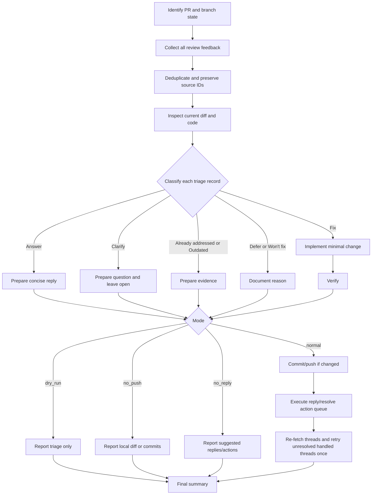

# PR Feedback Triage

Triage pull request review feedback, decide what action each thread needs, make focused fixes when allowed, and report or resolve only what is actually handled.

## When to Use

- A PR has review comments, requested changes, unresolved review threads, or bot review findings.
- The user asks to address, respond to, or resolve PR feedback.
- The user provides a PR URL/number, a branch with an associated PR, or copied comments.

Do not use this skill for a first-pass code review with no existing feedback; use a code review skill instead.

## Inputs

- Pull request URL or number, or a current branch that has an associated pull request.
- Repository checkout or platform access sufficient to inspect the PR diff and review feedback.
- Optional reviewer priorities from the user, such as "only address blocking comments" or "do not reply on the PR platform".
- Optional operating mode flags: `dry_run`, `no_push`, and `no_reply`.

If no PR or review comments are identifiable, ask for the target PR or the copied comments before proceeding.

## Modes

- `dry_run`: inspect review feedback and report the triage only. Do not edit files, run write-mode formatters, commit, push, post replies, or resolve review threads.
- `no_push`: local edits and verification are allowed, but do not push commits or otherwise update the remote branch. Report the local diff or local commits that still need to be pushed. Do not resolve threads whose resolution depends on unpushed local edits.
- `no_reply`: do not post replies, submit reviews, or resolve review threads. Provide suggested replies and resolution actions in the final report instead.

When a mode disables an action, skip that destructive or externally visible action even if normal workflow text would otherwise allow it.

## Preflight

1. Identify the current branch and target PR.
2. Check tracked local changes with `git diff --name-only` and `git diff --cached --name-only`. Ignore untracked files unless the review feedback explicitly concerns them.
3. Check unpushed commits before relying on remote review feedback.
4. If tracked local changes or unpushed commits exist, warn that existing PR comments may not cover the latest local state. In `normal` mode, push only when the user request or repository workflow allows it; otherwise continue with a clearly reported limitation.

## Feedback Collection

Gather the complete feedback set before editing:

- Fetch unresolved review threads, requested-change reviews, PR-level summary comments, and copied comments.
- Use platform-native APIs/CLI when available. Paginate results; do not inspect only the first page of threads or comments.
- For bot reviewers that post both summary comments and inline comments, collect both. Summary comments often contain severity, rationale, and fix instructions; inline comments contain the exact file and line context.
- Preserve every thread/comment identifier needed to reply or resolve later.
- Compare each comment with the current diff and file contents because review lines can become outdated.

## Deduplication and Ordering

Build one triage record per distinct finding:

- Prefer exact review-thread identity when available.
- For duplicate bot findings appearing in both summary and inline comments, merge by exact issue title first, then by file path plus line range as a fallback.
- Prefer inline comments for location and current code context.
- Prefer summary comments for severity, category, rationale, and detailed agent prompts.
- Preserve the reviewer’s exact issue title and original wording where practical. Do not rename findings in a way that would make replies hard to map back to comments.
- Preserve the reviewer’s original ordering unless the user asks for priority reordering. Many review bots already order findings by severity.

Each triage record should track: original title, reviewer, source IDs, location, current applicability, severity/priority if available, disposition, planned action, verification, reply text if any, resolution decision, platform action attempted, and final platform state.

## Resolution Policy

In normal mode, `Resolve conversation` is the default action for any review thread that has been fully handled. A thread is handled when the requested change is implemented and verified, the current code already satisfies the comment, the comment is outdated and no longer applies, or a deliberate deferral/won't-fix response has been posted with a clear reason.

Keep a thread open only when it still needs reviewer, maintainer, or product input, the fix is local-only and not pushed, verification is missing for a material change, or the user explicitly requested `dry_run`, `no_push`, or `no_reply` behavior that prevents resolution.

When resolving a thread, add a concise reply first only if it provides useful context, such as what changed, why no code change was needed, why a finding was intentionally deferred, or why the original comment is now outdated. Do not add noisy replies for self-evident fixes unless project norms require them.

## Platform Action Contract

Do not treat triage as complete until every collected source ID reaches an explicit terminal state:

- `resolved`: a platform resolve action succeeded, or a re-check shows the thread is already resolved.
- `replied_left_open`: a reply or question was posted and the thread is intentionally left unresolved.
- `not_resolvable`: the source is a PR-level summary comment or copied comment that has no platform-level resolve action; reply or post a PR summary when useful.
- `skipped_by_mode`: `dry_run`, `no_push`, or `no_reply` prevented the external action.
- `failed_action`: a reply or resolve action was attempted and failed; include the attempted action and failure in the final summary.

In normal mode, build and execute a platform action queue after fixes are verified and pushed when needed:

- `reply_then_resolve`: use for handled threads where the reviewer needs context before resolution.
- `resolve_only`: use for self-evident fixes and already-addressed or outdated threads where an extra reply would add noise.
- `reply_leave_open`: use only for clarification requests, blocked work, or intentionally open follow-ups.
- `reply_only`: use for PR-level comments or summaries that cannot be resolved as review threads.

For duplicate findings, execute the terminal action for every source thread ID, not only the primary triage record. If one finding is represented by three unresolved inline threads, all three must be resolved or explicitly left open.

## GitHub Action Guidance

Prefer platform-native APIs or `gh` commands that expose review-thread resolution state. For GitHub inline review threads, use the thread node ID and the GraphQL `resolveReviewThread` mutation rather than assuming that a reply resolves the conversation.

A reliable pattern is:

1. Re-fetch review threads and comments immediately before acting.
2. Reply to the thread when the action queue says a reply is needed.
3. Resolve the review thread by node ID when the terminal state should be `resolved`.
4. Re-fetch unresolved review threads after the action queue completes.
5. Retry any expected-to-be-resolved thread that is still unresolved once; if it still remains unresolved, mark it `failed_action` instead of claiming completion.

Example GraphQL mutation shape:

```graphql
mutation ($threadId: ID!) {
  resolveReviewThread(input: { threadId: $threadId }) {
    thread {
      id
      isResolved
    }
  }
}
```

A posted reply alone is sufficient only for `reply_leave_open`, `reply_only`, or `not_resolvable` sources. For handled inline review threads, reply and resolve are separate actions.

## Flow



## Compact Workflow

1. **Collect all relevant feedback**
   - Identify the PR and gather unresolved review threads, requested-change reviews, PR-level summaries, inline comments, and copied comments.
   - Paginate all platform calls and keep comment/thread IDs for later replies and resolution.
   - For bot reviews, collect both summary and inline comments, then merge duplicates rather than fixing the same finding twice.

2. **Classify each triage record**
   - **Fix**: Valid requested change; make the smallest focused edit when not in `dry_run`.
   - **Answer**: No code change needed; prepare a concise explanation.
   - **Clarify**: Ambiguous, conflicting, or missing context; reply with the question and leave unresolved.
   - **Already addressed**: Current code already satisfies it; prepare evidence.
   - **Outdated**: Commented code or issue no longer exists; prepare evidence.
   - **Defer / Won't fix**: Valid concern intentionally not changed now; document a specific reason.

3. **Act according to the classification and mode**
   - Keep edits scoped to the review feedback.
   - Follow reviewer-provided fix instructions literally when they are still applicable; deviate only when the current code proves the instruction is stale or unsafe.
   - In `dry_run`, stop at triage, proposed fixes, suggested replies, and verification plan.
   - In `no_push`, local edits are allowed, but do not push or resolve threads whose fix is only local. Reply or resolve non-code, already-addressed, or outdated threads only when the action does not depend on unpushed work and `no_reply` is not set.
   - In `no_reply`, do not post replies or resolve threads; report suggested replies/actions instead.
   - In normal mode, commit and push changed code when appropriate, then execute the platform action queue for every collected source ID.

4. **Verify before claiming completion**
   - For fixes, run appropriate checks or explain why they could not run.
   - Re-inspect the updated diff and comment context to confirm the concern is resolved.
   - Re-fetch review threads after reply/resolve actions and confirm all expected-to-be-resolved thread IDs are resolved.
   - Do not mark a thread resolved if it still needs reviewer, maintainer, or product input.
   - If a resolve or reply operation fails, retry once when safe; then report `failed_action` with the affected source ID and reason.

5. **Finish**
   - Normal mode: commit/push changes when appropriate, post useful replies or a summary, resolve all handled threads by default, and reconcile the final unresolved set.
   - Safe modes: report the local state and the exact replies/resolution actions a human could take.

## Reply Guidance

- Keep inline replies short and tied to the original title or concern.
- For fixed findings, mention the concrete change or commit if useful.
- For already-addressed or outdated findings, cite the current code path or behavior that makes the finding no longer applicable.
- For deferred or won't-fix findings, provide the reason and any follow-up issue or owner if known.
- If a reply or resolve operation fails, continue with the remaining threads and report the failure in the final summary.

## Final Summary Checklist

- Mode used: `normal`, `dry_run`, `no_push`, or `no_reply`
- Counts by disposition: fixed, answered, clarified/left open, already addressed, outdated, deferred/won't-fix
- Counts by platform terminal state: resolved, replied-left-open, not-resolvable, skipped-by-mode, failed-action
- Threads resolved, intentionally left open, already resolved, or resolution actions skipped by mode
- Any expected-to-be-resolved thread that remained unresolved after retry
- Verification run or planned
- Commits pushed, local diff/commits, or "none"
- Remaining open items and who needs to respond
