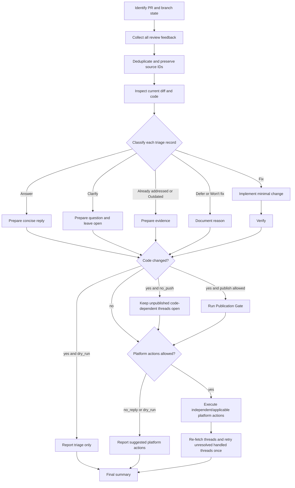

# PR Feedback Triage

Triage pull request review feedback, decide what action each thread needs, make focused fixes when allowed, and report or resolve only what is actually handled.

## When to Use

- A PR has review comments, requested changes, unresolved review threads, or bot review findings.
- The user asks to address, respond to, or resolve PR feedback.
- The user provides a PR URL/number, a branch with an associated PR, or copied comments.

Do not use this skill for a first-pass code review with no existing feedback; use a code review skill instead.

## Inputs

- Pull request URL or number, or a current branch that has an associated pull request.
- Repository checkout or platform access sufficient to inspect the PR diff and review feedback.
- Optional reviewer priorities from the user, such as "only address blocking comments" or "do not reply on the PR platform".
- Optional operating mode flags: `dry_run`, `no_push`, and `no_reply`.

If no PR or review comments are identifiable, ask for the target PR or the copied comments before proceeding.

## Modes

- `dry_run`: inspect review feedback and report the triage only. Do not edit files, run write-mode formatters, commit, push, post replies, or resolve review threads.
- `no_push`: local edits and verification are allowed, but do not push commits or otherwise update the remote branch. Report the local diff or local commits that still need to be pushed. Do not resolve threads whose resolution depends on unpushed local edits.
- `no_reply`: do not post replies, submit reviews, or resolve review threads. Provide suggested replies and resolution actions in the final report instead. This does not disable commit or push unless `dry_run` or `no_push` is also set.

A mode disables only the actions it names; do not infer `no_push` from `no_reply` or silently downgrade normal execution to a local-only result.

## Preflight

1. Identify the current branch and target PR.
2. Check tracked local changes with `git diff --name-only` and `git diff --cached --name-only`. Ignore untracked files unless the review feedback explicitly concerns them.
3. Check unpushed commits before relying on remote review feedback.
4. If tracked local changes or unpushed commits exist, warn that existing PR comments may not cover the latest local state. Handle publication under the Publication Gate below; report any authentication, branch-protection, or repository-policy blocker explicitly.

## Feedback Collection

Gather the complete feedback set before editing:

- Fetch unresolved review threads, requested-change reviews, inline comments, copied comments, and PR-level summary comments.
- Use whichever authenticated GitHub-capable interface is available and reliable. This skill explicitly permits both `gh` and GitHub MCP tools; paginate results and do not inspect only the first page of threads or comments.
- For bot reviewers that post both summary comments and inline comments, prefer inline comments for actionable triage. Incorporate summary findings only when they contain distinct severity, rationale, or fix instructions not already captured from inline comments.
- Summary comments may be excluded from triage when they do not add distinct actionable context.
- Preserve every thread/comment identifier needed to reply or resolve later.
- Compare each comment with the current diff and file contents because review lines can become outdated.

## Deduplication and Ordering

Build one triage record per distinct finding:

- Prefer exact review-thread identity when available.
- For duplicate bot findings appearing in both summary and inline comments, merge by exact issue title first, then by file path plus line range as a fallback.
- Prefer inline comments for location and current code context.
- Use summary comments only for distinct severity, category, rationale, or detailed agent prompts that are not already available from inline comments.
- Preserve the reviewer’s exact issue title and original wording where practical. Do not rename findings in a way that would make replies hard to map back to comments.
- Preserve the reviewer’s original ordering unless the user asks for priority reordering. Many review bots already order findings by severity.

Each triage record should track: original title, reviewer, source IDs, location, current applicability, severity/priority if available, disposition, planned action, verification, reply text if any, resolution decision, platform action attempted, and final platform state.

## Resolution Policy

In normal mode, `Resolve conversation` is the default action for any review thread that has been fully handled. A thread is handled when the requested change is implemented, verified, and published when required by the Publication Gate; the current code already satisfies the comment; the comment is outdated and no longer applies; or a deliberate deferral/won't-fix response has been posted with a clear reason.

Keep a thread open only when it still needs reviewer, maintainer, or product input, its fix is unpublished, verification is missing for a material change, or the selected mode prevents resolution.

When resolving a thread, add a concise reply first only if it provides useful context, such as what changed, why no code change was needed, why a finding was intentionally deferred, or why the original comment is now outdated. Do not add noisy replies for self-evident fixes unless project norms require them.

## Platform Comment Style

- Keep every posted reply or comment brief: one sentence by default, two short sentences only when necessary.
- Do not post PR-level summary or status comments by default. Omit them when they only restate completed fixes, resolved threads, or verification already visible in commits/checks.
- Avoid templates, long bullet lists, exhaustive status logs, and duplicated explanations in platform comments.
- For simple fixes, already-addressed findings, or outdated findings, prefer `resolve_only` over adding a reply.

## Platform Action Contract

Do not treat triage as complete until every incorporated source ID reaches an explicit terminal state:

- `resolved`: a platform resolve action succeeded, or a re-check shows the thread is already resolved.
- `replied_left_open`: a reply or question was posted and the thread is intentionally left unresolved.
- `not_resolvable`: the source is a PR-level summary comment or copied comment that has no platform-level resolve action; post a brief reply only when useful.
- `skipped_by_mode`: `dry_run`, `no_push`, or `no_reply` prevented the external action.
- `failed_action`: publication is blocked, or a publication, reply, or resolve action was attempted and failed; include the action or blocker in the final summary.

For code-dependent threads, satisfy the Publication Gate before replying or resolving. Then execute the applicable action:

- `reply_then_resolve`: handled thread where the reviewer needs context before resolution.
- `resolve_only`: self-evident fix, already-addressed finding, or outdated thread where an extra reply adds noise.
- `reply_leave_open`: clarification request, blocked work, or intentional follow-up.
- `reply_only`: PR-level comment or summary that cannot be resolved, only when a short reply adds value.

For duplicate findings, execute the terminal action for every source thread ID, not only the primary triage record.

## GitHub Action Guidance

Use whichever authenticated GitHub-capable interface is available and reliable, preferably `gh` or GitHub MCP. Prefer interfaces that expose review-thread resolution state. For GitHub inline review threads, use the thread node ID and the GraphQL `resolveReviewThread` mutation, or an equivalent GitHub MCP resolve-thread tool, rather than assuming that a reply resolves the conversation.

### Publication Gate

After a verified in-scope code change, unless `dry_run` or `no_push` is set, publish only changes attributable to the selected review feedback, including newly created files. If publishing them would also push unrelated pre-existing changes or commits, do not push and treat publication as `failed_action`.

1. Commit those changes.
2. Push the resulting commits to the PR head branch.
3. Re-fetch the PR head or remote branch and confirm the pushed commit is present or is an ancestor of the current head.

Do not finish or resolve code-dependent threads until this gate succeeds. If commit, push, or remote confirmation fails, retry once when safe, continue independent platform actions, and report the blocker. `no_reply` does not bypass this gate.

### Thread Actions

1. Re-fetch review threads and comments immediately before acting.
2. Reply when the action queue requires context.
3. Resolve handled review threads by node ID.
4. Re-fetch unresolved review threads after the queue completes.
5. Retry any expected-to-be-resolved thread that remains unresolved once; otherwise mark it `failed_action`.

Example GraphQL mutation shape:

```graphql
mutation ($threadId: ID!) {
  resolveReviewThread(input: { threadId: $threadId }) {
    thread {
      id
      isResolved
    }
  }
}
```

A posted reply alone is sufficient only for `reply_leave_open`, `reply_only`, or `not_resolvable` sources. For handled inline review threads, reply and resolve are separate actions.

## Flow


```mermaid
flowchart TD
  A[Identify PR and branch state] --> B[Collect all review feedback]
  B --> C[Deduplicate and preserve source IDs]
  C --> D[Inspect current diff and code]
  D --> E{Classify each triage record}
  E -->|Fix| F[Implement minimal change]
  E -->|Answer| G[Prepare concise reply]
  E -->|Clarify| H[Prepare question and leave open]
  E -->|Already addressed or Outdated| I[Prepare evidence]
  E -->|Defer or Won't fix| J[Document reason]
  F --> K[Verify]
  G --> L{Code changed?}
  H --> L
  I --> L
  J --> L
  K --> L
  L -->|yes and dry_run| M[Report triage only]
  L -->|yes and no_push| N[Keep unpublished code-dependent threads open]
  L -->|yes and publish allowed| P[Run Publication Gate]
  L -->|no| T{Platform actions allowed?}
  N --> T
  P --> T
  T -->|no_reply or dry_run| O[Report suggested platform actions]
  T -->|yes| R[Execute independent/applicable platform actions]
  R --> S[Re-fetch threads and retry unresolved handled threads once]
  M --> Q[Final summary]
  O --> Q
  S --> Q
```

## Compact Workflow

1. **Collect all relevant feedback**
   - Identify the PR and gather unresolved review threads, requested-change reviews, inline comments, copied comments, and PR-level summaries.
   - Paginate all platform calls and keep comment/thread IDs for later replies and resolution.
   - For bot reviews, prioritize inline comments and incorporate summary findings only when they add distinct actionable context.

2. **Classify each triage record**
   - **Fix**: valid requested change; make the smallest focused edit when not in `dry_run`.
   - **Answer**: no code change needed; prepare a concise explanation.
   - **Clarify**: ambiguous, conflicting, or missing context; reply with the question and leave unresolved.
   - **Already addressed**: current code already satisfies it; prepare evidence.
   - **Outdated**: commented code or issue no longer exists; prepare evidence.
   - **Defer / Won't fix**: valid concern intentionally not changed now; document a specific reason.

3. **Act according to classification and mode**
   - Keep edits scoped to the review feedback and follow still-applicable reviewer fix instructions.
   - `dry_run`: stop at triage, proposed fixes, suggested replies, and verification plan.
   - `no_push`: edit and verify locally; keep code-dependent threads open, but continue independent platform actions unless `no_reply` is also set.
   - `no_reply`: skip platform replies/resolution only; run the Publication Gate for code changes unless another mode disables publication.
   - Otherwise, run the Publication Gate when needed, then execute the platform action queue.

4. **Verify and finish**
   - Run appropriate checks for fixes or explain why they could not run, then re-inspect the diff and comment context.
   - Re-fetch review threads after platform actions and confirm expected terminal states.
   - Retry safe failed actions once; report remaining blockers instead of claiming completion.
   - Finish only when the Publication Gate is satisfied or explicitly skipped/blocked and every incorporated source ID has a terminal state under the Platform Action Contract.

## Reply Guidance

- Keep inline replies short: one sentence by default, two short sentences only when needed.
- For fixed findings, mention the concrete change or commit only if it helps the reviewer.
- For already-addressed or outdated findings, cite the current code path or behavior only as briefly as needed.
- For deferred or won't-fix findings, provide the reason and any follow-up issue or owner if known.
- Avoid posting PR-level summary comments unless they communicate a decision, blocker, or requested reviewer action.
- If a reply or resolve operation fails, continue with the remaining threads and report the failure in the final summary.

## Final Summary Checklist

- Mode used: `normal`, `dry_run`, `no_push`, or `no_reply`
- Counts by disposition and platform terminal state
- Threads resolved, intentionally left open, already resolved, or skipped by mode
- Verification run or planned
- Publication Gate result: commit SHA(s) and remote confirmation, or the mode/blocker that prevented publication
- Any in-scope uncommitted or unpushed work that remains
- Remaining open items and who needs to respond
